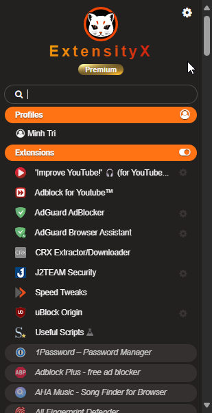

Sure, here's a detailed and impressive README file for your project on GitHub:

---

# ExtensityX

[](LICENSE)
[](https://github.com/xtri98/ExtensityX/releases)

ExtensityX is a powerful and elegant Chrome extension manager forked from the original [Extensity](https://github.com/sergiokas/Extensity). This project includes enhanced styling, improved usability, and new features to manage your Chrome extensions and apps seamlessly.

## Table of Contents

- [Features](#features)
- [Installation](#installation)
- [Usage](#usage)
- [Screenshots](#screenshots)
- [Contributing](#contributing)
- [License](#license)

## Features

### Improved Styling


- **Modern UI**: Redesigned with a sleek, modern look using CSS variables and flexbox layout.
- **Responsive Design**: Ensures optimal viewing experience across different devices and screen sizes.
- **Dark Mode**: Clean dark theme for comfortable use during night time.
=======
v1.12.0 (Sep 2024)
- Migrated to Chrome Manifest v3

### New Functionalities

- **Add/Remove Extensions**: Easily add or remove Chrome extensions from the list.
- **Quick Access**: Fast enable/disable extensions with a single click.
- **Profile Management**: Save and switch between different extension profiles for various workflows.

### Performance

- **Optimized Code**: Cleaned and optimized the original codebase for better performance and maintainability.
- **Seamless Transitions**: Smooth animations and transitions for a pleasant user experience.

## Installation

### From GitHub

1. Clone the repository:
   ```sh
   git clone https://github.com/xtri98/ExtensityX.git
   ```
2. Open Chrome and navigate to `chrome://extensions/`.
3. Enable "Developer mode" by toggling the switch in the upper right.
4. Click "Load unpacked" and select the `ExtensityX` directory you just cloned.

### From Chrome Web Store

_Coming Soon!_

## Usage

1. Click on the ExtensityX icon in the Chrome toolbar to open the extension.
2. Use the search bar to quickly find installed extensions and apps.
3. Enable or disable extensions with a single click.
4. Manage profiles to organize extensions for different tasks or projects.

## Screenshots


*Modern and intuitive user interface.*


*Easily manage different extension profiles.*

## Contributing

We welcome contributions from the community! To get started:

1. Fork the repository.
2. Create a new branch:
   ```sh
   git checkout -b feature/your-feature-name
   ```
3. Make your changes and commit them:
   ```sh
   git commit -m 'Add some feature'
   ```
4. Push to the branch:
   ```sh
   git push origin feature/your-feature-name
   ```
5. Open a pull request.

Please ensure your code adheres to the project's coding standards and includes appropriate tests.

## License

This project is licensed under the MIT License. See the [LICENSE](LICENSE) file for more details.

---

Thank you for using ExtensityX! If you like this project, please give it a star ⭐ on GitHub.

Feel free to reach out if you have any questions or feedback.

---

Replace `yourusername` with your actual GitHub username and ensure you provide the actual links to the screenshots and other resources as needed.Sure, here's a detailed and impressive README file for your project on GitHub:

---

# ExtensityX

[](LICENSE)
[](https://github.com/yourusername/ExtensityX/releases)

ExtensityX is a powerful and elegant Chrome extension manager forked from the original [Extensity](https://github.com/extensity/extensity). This project includes enhanced styling, improved usability, and new features to manage your Chrome extensions and apps seamlessly.

## Table of Contents

- [Features](#features)
- [Installation](#installation)
- [Usage](#usage)
- [Screenshots](#screenshots)
- [Contributing](#contributing)
- [License](#license)

## Features

### Improved Styling

- **Modern UI**: Redesigned with a sleek, modern look using CSS variables and flexbox layout.
- **Responsive Design**: Ensures optimal viewing experience across different devices and screen sizes.
- **Dark Mode**: Clean dark theme for comfortable use during night time.

### New Functionalities

- **Add/Remove Extensions**: Easily add or remove Chrome extensions from the list.
- **Quick Access**: Fast enable/disable extensions with a single click.
- **Profile Management**: Save and switch between different extension profiles for various workflows.

### Performance

- **Optimized Code**: Cleaned and optimized the original codebase for better performance and maintainability.
- **Seamless Transitions**: Smooth animations and transitions for a pleasant user experience.

## Installation

### From GitHub

1. Clone the repository:
   ```sh
   git clone https://github.com/xtri98/ExtensityX.git
   ```
2. Open Chrome and navigate to `chrome://extensions/`.
3. Enable "Developer mode" by toggling the switch in the upper right.
4. Click "Load unpacked" and select the `ExtensityX` directory you just cloned.

### From Chrome Web Store

_Coming Soon!_

## Usage

1. Click on the ExtensityX icon in the Chrome toolbar to open the extension.
2. Use the search bar to quickly find installed extensions and apps.
3. Enable or disable extensions with a single click.
4. Manage profiles to organize extensions for different tasks or projects.

## Screenshots


*Modern and intuitive user interface.*


*Easily manage different extension profiles.*

## Contributing

We welcome contributions from the community! To get started:

1. Fork the repository.
2. Create a new branch:
   ```sh
   git checkout -b feature/your-feature-name
   ```
3. Make your changes and commit them:
   ```sh
   git commit -m 'Add some feature'
   ```
4. Push to the branch:
   ```sh
   git push origin feature/your-feature-name
   ```
5. Open a pull request.

Please ensure your code adheres to the project's coding standards and includes appropriate tests.

## License

This project is licensed under the MIT License. See the [LICENSE](LICENSE) file for more details.

---

Thank you for using ExtensityX! If you like this project, please give it a star ⭐ on GitHub.

Feel free to reach out if you have any questions or feedback.

---